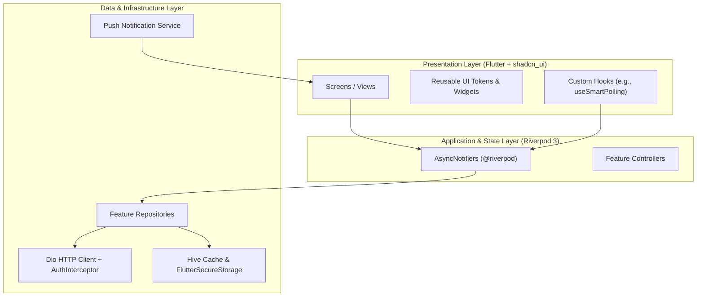

<div align="center">

# SlipWise

*Real-time sports betting accumulator tracker, live match score monitor, and automated bet slip manager.*

[](https://github.com/niyiayooluwa/slipwise-app/actions)
[](pubspec.yaml)
[](https://flutter.dev)
[](https://dart.dev)

[](https://riverpod.dev)
[](https://shadcn-ui-flutter.pages.dev)
[](https://shorebird.dev)
[](https://sentry.io)
[](#license)
[](https://github.com/niyiayooluwa/slipwise-app/pulls)

<p align="center">
  <a href="https://slipwise.niyiayo.com"><strong>Landing Page</strong></a> •
  <a href="#about">About</a> •
  <a href="#key-features">Features</a> •
  <a href="#architecture">Architecture</a> •
  <a href="#tech-stack">Tech Stack</a> •
  <a href="#getting-started">Getting Started</a> •
  <a href="#usage">Usage</a> •
  <a href="#project-structure">Structure</a> •
  <a href="#roadmap">Roadmap</a> •
  <a href="#contributing">Contributing</a> •
  <a href="#license">License</a>
</p>

</div>

---

## Table of Contents

- [About](#about)
- [Key Features](#key-features)
  - [Supported Bookmakers](#supported-bookmakers)
- [Architecture](#architecture)
- [Tech Stack](#tech-stack)
- [Getting Started](#getting-started)
  - [Prerequisites](#prerequisites)
  - [Installation](#installation)
  - [Configuration](#configuration)
    - [FCM Notification Specification](#fcm-notification-payload-specification)
- [Usage](#usage)
  - [Running in Development](#running-in-development)
  - [Building for Production](#building-for-production)
  - [Shorebird OTA Deployments](#shorebird-ota-deployments)
  - [Code Generation & Tooling](#code-generation--tooling)
- [Project Structure](#project-structure)
- [Roadmap](#roadmap)
- [Contributing](#contributing)
- [Testing & Quality Assurance](#testing--quality-assurance)
- [License](#license)
- [Contact](#contact)

---

## About

**SlipWise** is an intelligent, real-time sports betting accumulator tracking application built with Flutter. It streamlines how sports bettors monitor multibet tickets by ingesting booking codes, fetching market selections, monitoring live match scores minute-by-minute, and recalculating potential returns on the fly. Learn more on the official landing page at [slipwise.niyiayo.com](https://slipwise.niyiayo.com).

Instead of manually navigating disparate bookmaker interfaces to check each game, SlipWise provides an automated, battery-conscious polling engine and instant push alerts that notify you the moment your accumulator selections win, miss, or qualify for early action.

### Built With

- [Flutter](https://flutter.dev) — Cross-platform UI framework
- [Riverpod 3](https://riverpod.dev) — Reactive, compile-safe state management with code generation
- [shadcn_ui Flutter](https://shadcn-ui-flutter.pages.dev) — Accessible component system inspired by shadcn/ui
- [Hive](https://docs.hivedb.dev) — Ultra-fast, lightweight key-value offline storage
- [Shorebird](https://shorebird.dev) — Instant over-the-air (OTA) code push for Flutter apps
- [Firebase Cloud Messaging](https://firebase.google.com/docs/cloud-messaging) — Push notification delivery and deep linking

---

## Key Features

- ⚡ **Live Match Ticker & Smart Polling**: Displays live scores, match minutes, and game status indicators (`LIVE`, `FINISHED`, `NOT_STARTED`). Includes a battery-aware polling hook (`useSmartPolling`) that idles when matches conclude and auto-resumes when kickoffs approach.
- 🎫 **Instant Booking Code Ingestion**: Paste or enter bookmaker booking codes (e.g., SportyBet) to inspect games, individual market odds, kick-off dates, and total potential payout before committing to tracking.
- 📜 **Categorized Ticket History**: Switch between `All`, `Pending`, `Won`, and `Lost` views. Use discrete leg loss filters (`1 Cut`, `2 Cut`, `3 Cut`, `4+ Cut`) to evaluate close calls and near-misses.
- 🔍 **Multi-Parametric Filter Drawer**: Narrow tickets by betting provider, customizable date ranges (Today, This Week, This Month, Custom), or continuous odds sliders.
- 📊 **Deep Leg Breakdown**: Inspect match insights, home/away scores, tournament metadata, kickoff timers, and real-time status chips for every individual selection.
- 🔔 **Dual Notification Pipeline**: Firebase Cloud Messaging (FCM) routes deep links straight to the target ticket from terminated, background, or active states. High-priority Android heads-up alerts pair with in-app banner toasts for instant visibility.
- 💾 **Zero-Latency Offline Caching**: Hive-backed local boxes load ticket histories instantly upon app launch, syncing fresh data seamlessly in the background without UI blocking.
- 🔄 **Over-The-Air (OTA) Updates**: Built-in Shorebird integration downloads and applies critical hotfixes without requiring App Store or Google Play review cycles.

### Supported Bookmakers

| Bookmaker | Ingestion Format | Live Score Updates | Leg Verification | Status |
|---|---|---|---|---|
| **SportyBet** | Booking Code | Real-time | Supported | ✅ Production Ready |
| **Bet9ja** | Booking Code | Planned | - | 🚧 In Development |
| **1xBet** | Booking Code | Planned | - | 📋 On Roadmap |
| **BetKing** | Booking Code | Planned | - | 📋 On Roadmap |

---

<!--
## Screenshots & Demo

<div align="center">
  <p><i>Application previews and visual tour</i></p>
  
  &nbsp;&nbsp;&nbsp;&nbsp;
  
</div>

> [!NOTE]
> Additional production screenshots for the Active Dashboard, Ticket History Filter, and Leg Inspection views can be placed in `assets/screenshots/` and referenced here.

---
-->

## Architecture

SlipWise follows a feature-first, layered architecture designed for testability, state predictability, and modular scaling.



### Architectural Highlights

1. **Riverpod 3 Code Generation**: Leverages `@riverpod` annotations to generate strongly-typed providers and notifiers, ensuring automatic cache invalidation and zero boilerplate.
2. **Functional Error Handling**: Repositories return `Either<Failure, T>` using `dart_either`, isolating UI widgets from network and serialization exceptions.
3. **Resilient Token Lifecycle**: `AuthInterceptor` intercepts `401 Unauthorized` responses, temporarily queues concurrent requests, acquires a fresh JWT using the refresh token, and replays pending calls without user disruption.
4. **Stateful Navigation**: GoRouter's `StatefulShellRoute.indexedStack` retains state and scroll positions across the main navigation tabs (`Home`, `History`, `Profile`).

---

## Tech Stack

| Layer | Technology | Purpose |
|---|---|---|
| **Framework** | [Flutter 3.38.7](https://flutter.dev) | Cross-platform client framework |
| **Language** | [Dart 3.10.7](https://dart.dev) | Strictly typed client language |
| **State Management** | [Hooks Riverpod](https://pub.dev/packages/hooks_riverpod) | Reactive state management with codegen |
| **Component System** | [shadcn_ui](https://shadcn-ui-flutter.pages.dev) | Accessible, consistent UI component library |
| **Routing** | [GoRouter](https://pub.dev/packages/go_router) | Declarative URL-based deep linking and route guards |
| **HTTP Client** | [Dio](https://pub.dev/packages/dio) | Network client with token interceptors and retry handlers |
| **Local Cache** | [Hive Flutter](https://pub.dev/packages/hive_flutter) | Low-latency local storage for ticket history |
| **Secure Storage** | [Flutter Secure Storage](https://pub.dev/packages/flutter_secure_storage) | Encrypted keychain/keystore token storage |
| **Push Notifications** | [Firebase Messaging](https://pub.dev/packages/firebase_messaging) + [Local Notifications](https://pub.dev/packages/flutter_local_notifications) | Foreground heads-up toasts and background alerts |
| **Code Push (OTA)** | [Shorebird](https://shorebird.dev) | Instant hotfix delivery bypassing app store reviews |
| **Error Monitoring** | [Sentry Flutter](https://pub.dev/packages/sentry_flutter) | Real-time crash diagnostics and telemetry |
| **Data Modeling** | [Freezed](https://pub.dev/packages/freezed) + [JSON Serializable](https://pub.dev/packages/json_serializable) | Immutable data classes and serialization |

---

## Getting Started

### Prerequisites

Ensure you have the following tools installed on your development workstation:

- [Flutter SDK](https://docs.flutter.dev/get-started/install) (`3.38.7`)
- [Dart SDK](https://dart.dev/get-dart) (`^3.10.7`)
- Java Development Kit (JDK 17 or higher)
- Android Studio / Android SDK (Platform API 34+) or Xcode (for iOS builds)
- [Shorebird CLI](https://shorebird.dev) (optional, for OTA patch workflows)

Verify your Flutter installation:
```bash
flutter doctor
```

### Installation

1. **Clone the repository:**
   ```bash
   git clone https://github.com/niyiayooluwa/slipwise-app.git
   cd slipwise-app
   ```

2. **Install Flutter package dependencies:**
   ```bash
   flutter pub get
   ```

3. **Run code generation:**
   Generate Riverpod providers, Freezed models, and JSON serialization files:
   ```bash
   dart run build_runner build --delete-conflicting-outputs
   ```

4. **Verify static analysis:**
   ```bash
   dart analyze
   ```

### Configuration

#### API Endpoints
Base API URLs and network timeout constants are defined in `lib/core/constants/constants.dart`:

```dart
class ApiConstants {
  static const String baseUrl = 'https://api.slipwise.niyiayo.com';
  static const Duration connectTimeout = Duration(seconds: 12);
  static const Duration receiveTimeout = Duration(seconds: 12);
}
```

> [!TIP]
> For local backend development, modify `ApiConstants.baseUrl` to point to your local development instance (e.g., `http://10.0.2.2:8080` for Android Emulator).

#### Firebase Configuration
Native Firebase credentials must be configured for push notifications to function:
- **Android**: Place `google-services.json` in `android/app/google-services.json`
- **iOS**: Place `GoogleService-Info.plist` in `ios/Runner/GoogleService-Info.plist`
- Run `flutterfire configure` if updating project keys.

#### FCM Notification Payload Specification
Backend services dispatching real-time ticket alerts to SlipWise via Firebase Cloud Messaging must supply both the `notification` and `data` objects formatted as follows:

```json
{
  "notification": {
    "title": "Early Hit 🔥",
    "body": "Gett in jhoor! 🔥 Over 2.5 Goals don land for Arsenal 2-1 Chelsea."
  },
  "data": {
    "ticket_id": "7b0a8801-1b05-4c03-9ef4-d368097b69bb",
    "type": "ticket_update",
    "image": "https://media.giphy.com/media/3o7TKoWXm3okO1kgHC/giphy.gif"
  }
}
```

| Key | Type | Description |
|---|---|---|
| `notification.title` | `string` | Alert headline displayed in the system drawer and in-app toast |
| `notification.body` | `string` | Narrative match update or event summary |
| `data.ticket_id` | `string` (UUID) | Unique ticket identifier used for deep-link navigation directly to `/ticket-details?id=<id>` |
| `data.type` | `string` | Event category (`ticket_update`, `match_alert`, `early_hit`) |
| `data.image` | `string` (URL) | Optional image/GIF preview URL |

> [!NOTE]
> - **Background / Terminated**: Tapping the native system tray alert deep links directly to the ticket view.
> - **Foreground**: A high-priority heads-up notification and an in-app interactive toast banner (with a 1-tap **"View"** button) appear simultaneously.

---

## Usage

### Running in Development

Launch the app in debug mode on a connected device or emulator:

```bash
flutter run
```

To run with verbose logging:
```bash
flutter run -v
```

### Building for Production

#### Android APK
```bash
flutter build apk --release
```

#### Android App Bundle (Google Play Store)
```bash
flutter build appbundle --release
```

### Shorebird OTA Deployments

SlipWise supports dynamic over-the-air updates via Shorebird.

```bash
# Initialize and authenticate Shorebird
shorebird login

# Create a new base release
shorebird release android

# Push a patch directly to live devices
shorebird patch android
```

> [!IMPORTANT]
> **Shorebird Patch Rules & Gotchas**:
> Shorebird patches modify compiled Dart code in place. For an OTA patch to apply successfully without requiring a store reinstall:
> 1. **100% Pure Dart Only**: Never alter native files (`android/`, `ios/`, `AndroidManifest.xml`, `Info.plist`, Gradle configs, or Podfiles) in a patch.
> 2. **No Asset Manifest Changes**: Do not add, remove, or rename assets in `assets/` or `pubspec.yaml` during a patch.
> 3. **No New Native Dependencies**: Adding packages with native platform code requires a full base release (`shorebird release android`).
> 4. **Always Verify**: Run `dart analyze` before pushing a patch to guarantee zero syntax or linting errors.

### Code Generation & Tooling

Common development automation scripts:

```bash
# Watch files and regenerate models/providers on change
dart run build_runner watch --delete-conflicting-outputs

# Format all Dart files
dart format .

# Regenerate app launcher icons
dart run flutter_launcher_icons

# Regenerate native splash screens
dart run flutter_native_splash:create
```

---

## Project Structure

```text
slipwise/
├── .github/
│   └── workflows/
│       └── shorebird.yml         # CI workflow for Shorebird release & patch automation
├── android/                      # Native Android project configuration
├── assets/
│   ├── drawables/                # Vector artwork and custom illustrations
│   ├── fonts/                    # Bundled typography (Inter family)
│   ├── image/                    # Application logos and splash branding
│   └── legal/                    # Markdown documents for Terms and Privacy Policy
├── docs/                         # API documentation and Swagger specifications
├── lib/
│   ├── core/                     # Shared foundational infrastructure
│   │   ├── constants/            # API endpoints, storage keys, timing values
│   │   ├── errors/               # Domain failure models and network error mappers
│   │   ├── hooks/                # Custom Flutter hooks (useSmartPolling, etc.)
│   │   ├── providers/            # Global Riverpod state (UserNotifier, Network, Theme)
│   │   ├── server/               # Dio client & AuthInterceptor (token refresh)
│   │   ├── services/             # PushNotificationService & platform abstractions
│   │   ├── storage/              # Hive box initialization & secure storage wrappers
│   │   ├── ui/                   # Reusable atomic widgets, banners, and empty states
│   │   └── utils/                # Design tokens, formatters, and toast helpers
│   ├── modules/                  # Feature-first application modules
│   │   ├── auth/                 # Sign In, Sign Up, OTP Verification, Password Reset
│   │   ├── home/                 # Active tickets dashboard & live match polling
│   │   ├── main/                 # Bottom navigation shell layout & state persistence
│   │   ├── notifications/        # Inbox screen, notification controller, repository
│   │   ├── onboarding/           # Welcome carousel, splash screens, permissions
│   │   ├── profile/              # User profile, theme settings, Shorebird updates
│   │   └── tickets/              # Ticket tracking, pre-track preview, history & details
│   ├── router/                   # GoRouter routing table, shell routes, and auth guards
│   ├── firebase_options.dart     # Firebase client configuration
│   └── main.dart                 # Application entrypoint & container bootstrapping
├── pubspec.yaml                  # Project dependencies and asset manifests
├── sentry.properties             # Sentry build configuration
└── shorebird.yaml                # Shorebird project identification
```

---

## Roadmap

- [x] Automated booking code ingestion and bet preview
- [x] Real-time live score ticker with smart polling
- [x] Leg-by-leg status verification (Won, Cut, Pending, Live)
- [x] Offline-first caching with Hive
- [x] Dual-channel push notification architecture (FCM + Local Notifications)
- [x] Shorebird OTA hot-patching integration
- [ ] Multi-bookmaker code translation (convert SportyBet codes to Bet9ja/1xBet)
- [ ] Automated cash-out value evaluation calculator
- [ ] Social slip sharing with custom preview cards
- [ ] Comprehensive unit and integration test suite

---

## Contributing

Contributions are welcome! To contribute to SlipWise:

1. **Fork the repository** on GitHub.
2. **Create a feature branch**:
   ```bash
   git checkout -b feature/ticket-export
   ```
3. **Commit your changes**:
   ```bash
   git commit -m "feat(tickets): add CSV export for settled slips"
   ```
4. **Ensure clean analysis and formatting**:
   ```bash
   dart format --output=none --set-exit-if-changed .
   dart analyze
   ```
5. **Push to your fork**:
   ```bash
   git push origin feature/ticket-export
   ```
6. **Open a Pull Request** against the `main` branch with a clear description of your changes.

---

## Testing & Quality Assurance

Maintain strict code quality before submitting code:

```bash
# Format verification
dart format --output=none --set-exit-if-changed .

# Static analysis and lint checks
dart analyze

# Run unit and widget tests (when present)
flutter test
```

---

## License

Copyright © 2026 SlipWise. All rights reserved.

Unauthorized copying, modification, distribution, or commercial use of this software via any medium is strictly prohibited. For licensing inquiries, please contact the maintainers.

---

## Contact

- **Landing Page**: [https://slipwise.niyiayo.com](https://slipwise.niyiayo.com)
- **Author / Maintainer**: [Ayooluwa Niyi](https://github.com/niyiayooluwa)
- **Email / Inquiries**: [hello@slipwise.niyiayo.com](mailto:hello@slipwise.niyiayo.com)
- **Project Repository**: [https://github.com/niyiayooluwa/slipwise-app](https://github.com/niyiayooluwa/slipwise-app)
- **Issue Tracker**: [https://github.com/niyiayooluwa/slipwise-app/issues](https://github.com/niyiayooluwa/slipwise-app/issues)
